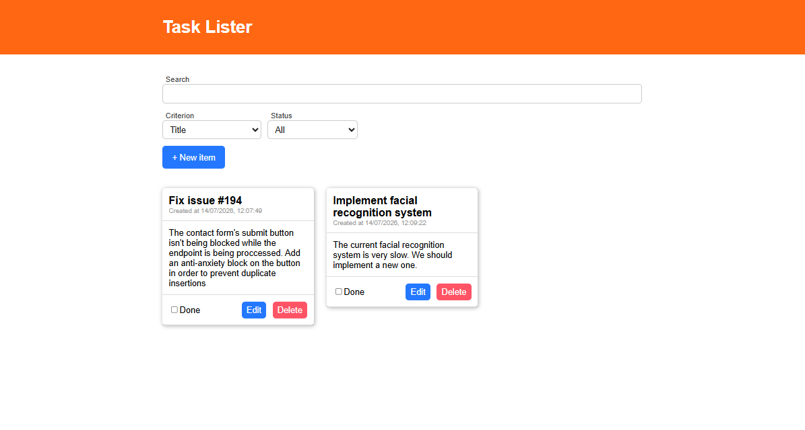
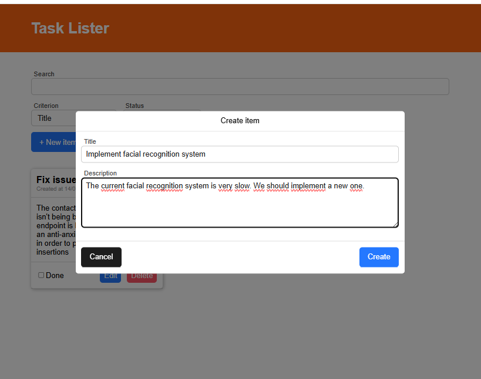
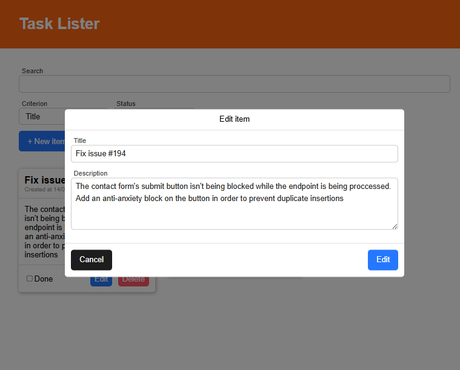
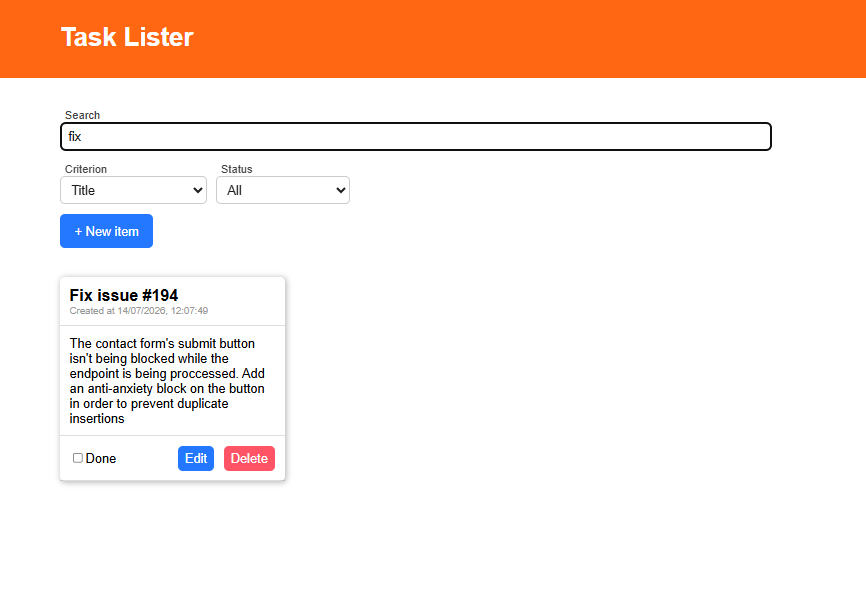
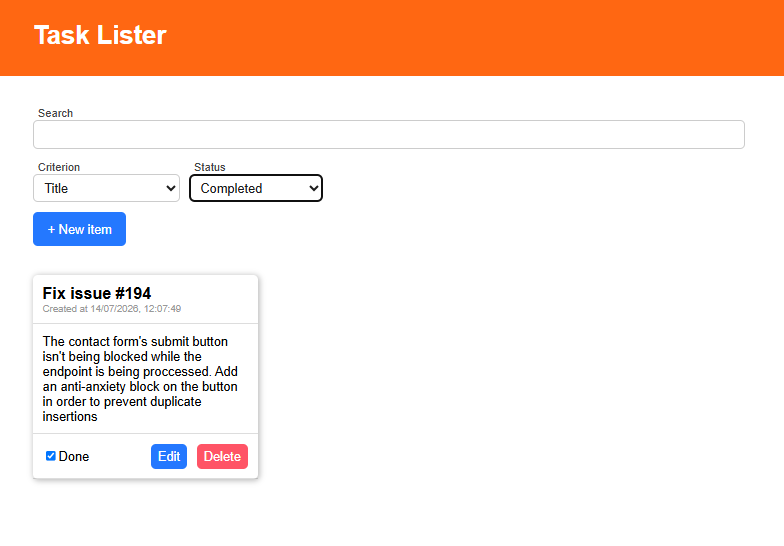

# Task Lister

A small single-page to-do list app. With this app, you can:

- Create tasks with a title and description
- Mark the tasks done
- Edit or delete the tasks (deletions require confirmation)
- Search/filter the list

This app was built with React 19, TypeScript, Vite, and Zustand.

## Screenshots

**Home page**



**Modal for creating new todo items**



**Modal for editing todo items**



**Search by title**



**Show only completed items**



## Tech stack

- **React 19** + **TypeScript**: UI
- **Vite**: dev server / build tool
- **Zustand**: state management (three small stores, see [Architecture](#architecture))
- **Vitest** + **React Testing Library**: automated tests
- **ESLint**: linting

## Getting started

```bash
npm install
npm run dev       # start the dev server (http://localhost:5173)
npm run build     # type-check and build for production
npm run preview   # preview the production build locally
npm run lint       # lint the codebase
```

## Testing

The tests are written with [Vitest](https://vitest.dev) and [React Testing Library](https://testing-library.com/docs/react-testing-library/intro/).

```bash
npm test              # run the full suite once
npm run test:watch    # re-run tests on file change, useful while developing
npm run test:coverage # run the suite and print a coverage report
```

Every `*.test.tsx` file sits next to the file it tests, so it's easy to find:

```
src/
├── App.test.tsx
└── components/
    ├── Card.test.tsx
    ├── form/
    │   ├── InputCheckbox.test.tsx
    │   ├── InputText.test.tsx
    │   ├── InputTextarea.test.tsx
    │   └── SelectField.test.tsx
    └── modals/
        ├── ModalDeleteConfirmation.test.tsx
        └── ModalItemCreation.test.tsx
```

**Coverage:**
- **Form components** (`InputText`, `InputTextarea`, `InputCheckbox`, `SelectField`): rendering, label association, value display, `onChange` wiring, and error states.
- **`Card`**: rendering a todo, and that the Done/Edit/Delete buttons drive the right store actions.
- **`ModalItemCreation`**: create vs. edit mode, validation (blocks submission and shows "Required field" errors), successful create/edit, and cancel.
- **`ModalDeleteConfirmation`**: cancelling leaves the todo untouched; confirming deletes it and closes the modal.
- **`App`**: empty state, rendering a list of todos, search-by-title filtering, the "no results" message, and the full "open modal → fill form → submit → see new card" flow end to end.

`Modal.tsx` (the shared backdrop/dialog wrapper used by both modals) isn't tested on its own. Its behavior (backdrop click and Escape to close) is covered indirectly through the two modals that use it.

**Conventions used across the tests:**
- Zustand stores are singletons, so each test file resets the relevant store's state in a `beforeEach` to keep tests independent of execution order and of each other.
- The component tests query the DOM the way a user would, using things such as label text and button roles (`getByLabelText`, `getByRole`).
- `userEvent` (not `fireEvent`) is used for interactions like typing and clicking, since it simulates real browser event sequences.

### Adding a new test

In order to create a new test, add a `<name>.test.tsx` file next to the code it covers, import the module under test, and reset any Zustand store state it touches in a `beforeEach`. `npm run test:watch` will pick it up automatically.

## Architecture

```
src/
├── App.tsx                          # top-level layout: header, search bar, list
├── components/
│   ├── Card.tsx                     # a single todo item
│   ├── form/                        # generic, presentational form inputs
│   └── modals/
│       ├── Modal.tsx                # shared dialog shell: backdrop, Escape/click-outside to close
│       ├── ModalItemCreation.tsx    # create/edit form, shown when modalIsOpen is true
│       └── ModalDeleteConfirmation.tsx  # delete confirmation, shown when modalConfirmIsOpen is true
├── store/
│   ├── useTodoStore.tsx             # the todos themselves (persisted to localStorage)
│   ├── useTodoFormStore.tsx         # draft state + validation errors for the open form
│   └── useModalStore.tsx            # which modal (if any) is open
├── utils/
│   └── options.tsx                  # option lists for the search-by/status selects
└── interfaces/
    ├── modal.tsx                    # contains an interface for the modal store's state
    └── todo.tsx                     # contains interfaces for todo items and for the todo form
```

State is split into three independent Zustand stores rather than one global store:

- **`useTodoStore`** owns the list of todos and CRUD actions (`addTodo`, `editTodo`, `toggleTodo`, `deleteTodo`). It's wrapped in Zustand's `persist` middleware, so todos survive a page reload (stored under the `todo-storage` key in `localStorage`).
- **`useTodoFormStore`** owns the draft values and validation errors for whichever form is currently open. `loadForm(todo)` populates it for editing or for the item pending deletion; `formReset()` clears it for creating a new item.
- **`useModalStore`** tracks two independent open/closed flags: `modalIsOpen` for the create/edit modal, and `modalConfirmIsOpen` for the delete-confirmation modal.

`ModalItemCreation` decides whether to `addTodo` or `editTodo` based on whether `todoForm.id` is set (`0` = new item, non-zero = editing an existing one). `ModalDeleteConfirmation` reads the same `todoForm` (populated via `loadForm` when Delete is clicked on a `Card`) to know which todo to remove and to show its title in the confirmation prompt.

Both modals share their backdrop/dialog chrome via `Modal.tsx`, which handles closing on a backdrop click or the Escape key and applies `role="dialog"`/`aria-modal` for accessibility, so that behavior only needs to be implemented once.
